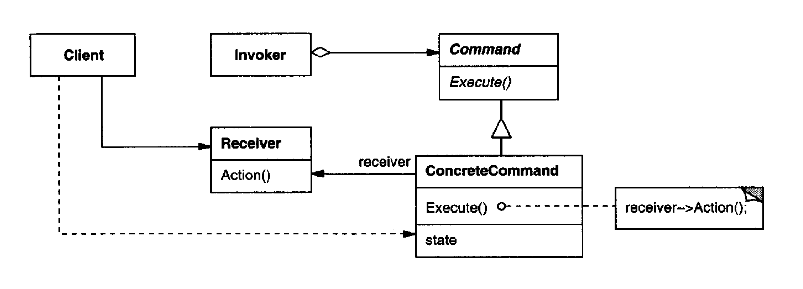

Encapsulate a request as an object, thereby letting you parameterize clients with
different requests, queue or log requests, and support undoable operations.

    Command is a behavioral design pattern that turns a request into a stand-alone object that contains all information about the request. 

# Applicability

**Parameterize objects by an action to perform**.
You can express such parameterization in a procedural language with a
callback function, that is, a function that's registered somewhere to be called
at a later point. Commands are an object-oriente d replacement for callbacks.

Specify, queue, and execute requests at different times. A Command object
can have a lifetime independent of the original request. If the receiver of a
request can be represented in an address space-independent wa y, then you
can transfer a command object for the request to a different process and fulfill
the request there.

Support undo. The Command's Execute operation ca n store state for reversing
its effects in the command itself. The Command interface must have an
added Unexecute operation that reverses the effects of a previous call to Execute. 
Executed commands are stored in a history list. Unlimited-level undo
and redo is achieved by traversing this list backwards and forwards calling
Unexecute and Execute, respectively.

support logging changes so that they can be reapplied in case of a system
crash. By augmenting the Command interface with load and store operations,
you can keep a persistent log of changes. Recovering from a crash
involves reloading logged commands from disk and reexecuting them with
the Execute operation.

## Pros

**Single Responsibility Principle**. You can decouple classes that invoke operations from classes that perform these operations.

Command **decouples the object** that invokes the operation from the one that
knows how to perform it.

**Open/Closed Principle**. You can introduce new commands into the app without breaking existing client code.

It's easy to add new Commands, because you don't have to change existing
classes. 

You can implement undo/redo.

You can implement deferred execution of operations.

## Cons 

The code may become more complicated since you’re introducing a whole new layer between senders and receivers.

## Comments worth mentioning

## Comments about Implementation worth mentioning

# Diagram

