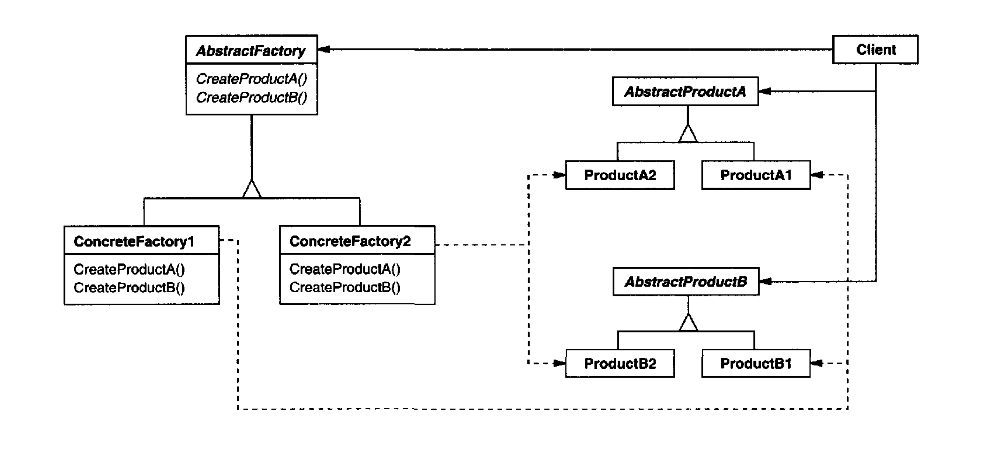

Provide an interface for creating families of related or dependent objects without
specifying their concrete classes.

    
# Applicability

Use the Abstract Factory pattern when

A system should be independent of how its products are created, composed, and represented

A system should be configured with one of multiple families of products.

    Use the Abstract Factory when your code needs to work with various families of related products, but you don’t want it to depend on the concrete classes of those products—they might be unknown beforehand or you simply want to allow for future extensibility.

A family of related product objects is designed to be used together, and you
need to enforce this constraint.

## Pros

Clients manipulate instances through their abstract interfaces. Product class names are isolated in the implementation of the concrete factory; they do not appear in client code.

Single Responsibility Principle. You can extract the product creation code into one place, making the code easier to support

Open/Closed Principle. You can introduce new variants of products without breaking existing client code

It promotes consistency among products. & You can be sure that the products you’re getting from a factory are compatible with each other.

## Cons 

Supporting new kinds of products is difficult. Supporting new kinds of
products requires extending the factory interface, which involves changing
the Abstract Factory class and all of its subclasses.

## Comments worth mentioning

It makes exchanging product families easy. The class of a concrete factory appears
only once in an application—that is, where it's instantiated. This makes it
easy to change the concrete factory an application uses. It can use different
product configurations simply by changing the concrete factory. **Because an
abstract factory creates a complete family of products, the whole product
family changes at once**.

## Comments about Implementation worth mentioning

If many product families are possible, the concrete factory can be implemented using the **Prototype pattern. The concrete factory is initialized with a prototypical instance of each product in the family, and it creates a new product by cloning its prototype. The Prototype-based approach eliminates the need for a new concrete factory class for each new product family.

A more flexible but less safe design is to add a parameter to operations that create objects. This parameter specifies the kind of object to be created. It could be a class identifier, an integer, a string, or anything else that identifies the kind of product. In fact with this approach, AbstractFactory only needs a single "Make" operation with a parameter indicating the kind of object to create. [the downside ...] Although the client could perform a downcast (e.g., with dynamic_cast in C++), that's not always feasible or safe, because the downcast can fail.

[The abstract factory can be just a class, so that it can act as a concrete factory,
unless you need to override it]

A concrete factory is often a singleton 

# Diagram

