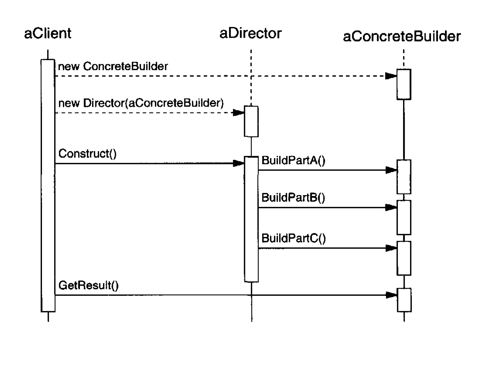

Separate the construction of a complex object from its representation so that the
same construction process can create different representations.
    
# Applicability

Use the Builder pattern when

the algorithm for creating a complex object should be independent of the
parts that make up the object and how they're assembled. [the algorithm that interprets
can be extracted out of the creation and representation]

the construction process must allow different representations for the object
that's constructed

## Pros

## Cons 

## Comments worth mentioning

1. *It lets you vary a product's internal representation*. Becaus e the product
is constructed through an abstract interface, all you have to do to change the
product's internal representation is define a new kind of builder.

2. *It isolates code for construction and representation*. Clients needn't know anything about the classes that define the product's internal structure; such classes don't appear in Builder's interface. [this let us have different Directors that can reuse a builder to create Product variants from the same set of parts.] 

3. *finer control*. the Builder interface reflects the process of constructing the product more than other creational
patterns. This gives you finer control over the construction process
and consequently the internal structure of the resulting product.

## Comments about Implementation worth mentioning
# Diagram

