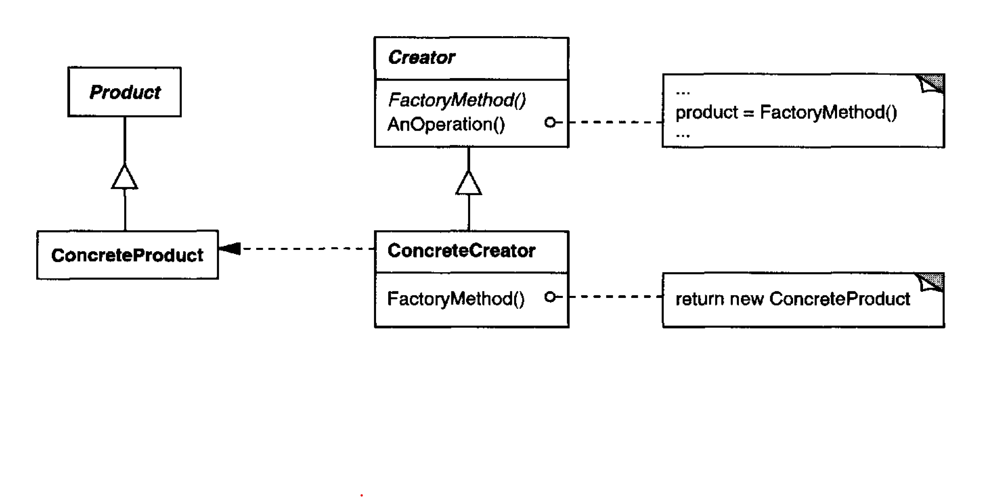

Define an interface for creating an object, but let subclasses decide which class to
instantiate. Factory Method lets a class defer instantiation to subclasses.

# Applicability

A class can't anticipate the class of objects it must create. Use the Factory Method when you don’t
know beforehand the exact types and dependencies of the objects your code should work with.

A class wants its subclasses to specify the objects it creates. [Which I link to] Use the Factory Method when you
want to provide users of your library or framework with a way to extend its internal components.

classes delegate responsibility to one of several helper subclasses, and you
want to localize the knowledge of which helper subclass is the delegate.

## Pros

You avoid tight coupling between the creator and the concrete products.

**Single Responsibility Principle**. You can move the product creation code into one place in the
program, making the code easier to support.

**Open/Closed Principle**. You can introduce new types of products into the program without 
breaking existing client code

## Cons 

The code may become more complicated since you need to introduce a lot of new subclasses to implement
the pattern. The best case scenario is when you’re introducing the pattern into an existing
hierarchy of creator classes

## Comments about Implementation worth mentioning

1. Two major varieties.The two main variations of the FactoryMethod pattern are
(1) the case when the Creator class is an abstract class and does not provide
an implementation for the factory method it declares, and (2) the case when
the Creator is a concrete class and provides a default implementation for
the factory method. [this case is mentioned to be desired because is a better
alternative than directly instantiating a dependency]

2. Parameterized factory methods. Another variation on the pattern lets the factory
method create multiple kinds of products. The factory method takes a parameter that identifies 
the kind of object to create.

[this implementation opens up new possibilities]

Overriding a parameterized factory method lets you easily and selectively
extend or change the products that a Creator produces. You can introduce
new identifiers for new kinds of products, or you can associate existing
identifiers with different products.

# Diagram

