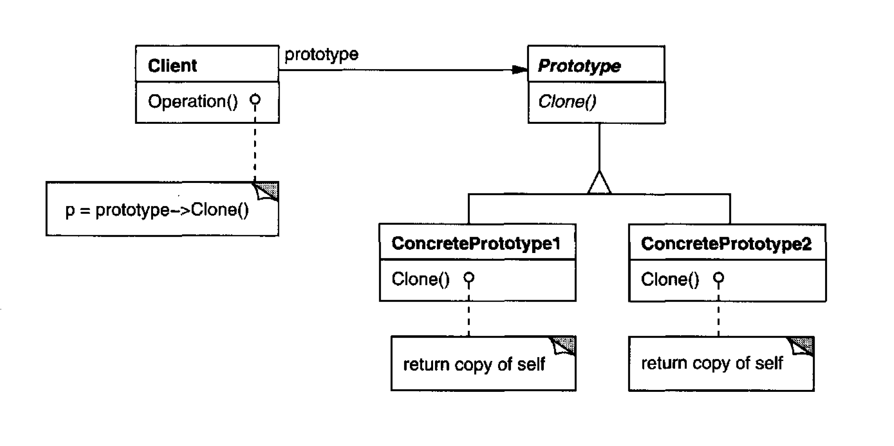

Specify the kinds of objects to create using a prototypical instance, and create new
objects by copying this prototype.

# Applicability

Use the Prototype pattern when a system should be independent of how its products are created, composed, and represented; and

    [which i link to] Use the Prototype pattern when your code shouldn’t depend on the concrete classes of objects that you need to copy.  Since you have to know the object’s class to create a duplicate, your code becomes dependent on that class. If the extra dependency doesn’t scare you, there’s another catch. Sometimes you only know the interface that the object follows, but not its concrete class, when, for example, a parameter in a method accepts any objects that follow some interface.

When the classes to instantiate are specified at run-time, for example, by dynamic loading; or

To avoid building a class hierarchy of factories that parallels the class hierarchy of products; or

when instances of a class can have one of only a few different combinations of state. It may be more convenient to install a corresponding number of
prototypes and clone them rather than instantiating the class manually, each time with the appropriate state. [I link this applicability to Pros #2 and #3]

## Pros

You can clone objects without coupling to their concrete classes.

You can get rid of repeated initialization code in favor of cloning pre-built prototypes.

You can produce complex objects more conveniently.

You get an alternative to inheritance when dealing with configuration presets for complex objects.

## Cons 

The main liability of the Prototype pattern is that each subclass of Prototype must
implement the Clone operation, which may be difficult. For example, adding
Clone is difficult when the classes under consideration already exist. Implementing
Clone can be difficult when their internals include objects that don't support
copying or have circular references

    Cloning complex objects that have circular references might be very tricky (Refactoring Guru).

## Comments worth mentioning

This kind of design lets users define new "classes" without programming.
In fact, cloning a prototype is similar to instantiating a class. The Prototype
pattern can greatly reduce the number of classes a system needs. 

    In our music editor, one GraphicTool class can create a limitless variety of music objects

Specifying new objects by varying structures. [you can use different templates on the same type of object]

Reduced subclassing. FactoryMethod often produces a hierarchy of Creator
classes that parallels the product class hierarchy. **The Prototype pattern
lets you clone a prototype instead of asking a factory method to make a new
object**.

Configuring an application with classes dynamically. [You can have a registry, in its simplest form, an array]

## Comments about Implementation worth mentioning

Initializing clones. While some clients are perfectly happy with the clone as
is, others will want to initialize some or all of its internal state to values of their choosing. You 
generally can't pass these values in the Clone operation, because their number will 
vary between classes of prototypes. Some prototypes might need multiple initialization 
parameters; others won't need any. Passing parameters in the Clone operation precludes a uniform cloning interface.

# Diagram

