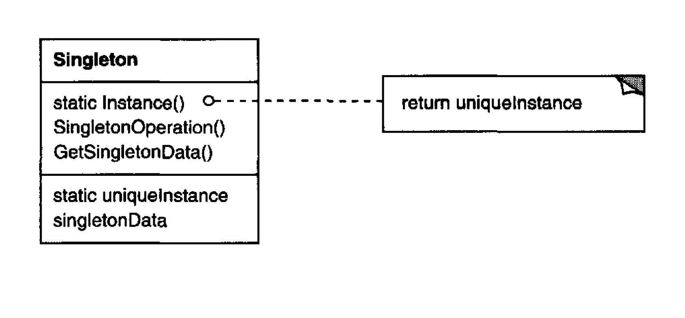

Ensure a class only has one instance, and provide a global point of access to it.

# Applicability

There must be exactly one instance of a class, and it must be accessible to
clients from a well-known access point.

When the sole instance should be extensible by subclassing, and clients
should be able to use an extended instance without modifying their code.

(R.G) Use the Singleton pattern when you need stricter control over global 
variables.

## Pros

You can be sure that a class has only a single instance.

You gain a global access point to that instance.

The singleton object is initialized only when it’s requested for the first time.

## Cons 

The pattern requires special treatment in a multithreaded environment so that multiple threads won’t create a singleton object several time.

## Comments worth mentioning

Reduced name space. The Singleton pattern is an improvement over global
variables. It avoids polluting the name space with global variables that store
sole instances. [which map directly to the refactoring guru applicability item]

Permits refinement of operations and representation. The Singleton class **may be
subclassed**, and it's easy to configure an application with an instance of this
extended class. You can configure the application with an instance of the
class you need at run-time.

Permits a variable number of instances. **The pattern makes it easy to change your
mind and allow more than one instance of the Singleton class**. Moreover,
you can use the same approach to control the number of instances that
the application uses. Only the operation that grants access to the Singleton
instance needs to change

## Comments about Implementation worth mentioning

Subclassing the Singleton class. The main issue is not so much defining the
subclass but installing its unique instance so that clients will be able to use
it. In essence, **the variable that refers to the singleton instance must get
initialized with an instance of the subclass.**

    An example in the Sample Code shows how to implement this
    technique with environment variables.

Another way to choose the subclass of Singleton is to take the implementation
of Instance out of the parent cl ass (e. g. , MazeFactory) and put it in the
subclass. 

**A more flexible approach uses a registry of singletons**. Instead of having
Instance define the set of possible Singleton classes, the Singleton classes
can register their singleton instanc e by name in a well-known registry.
The registry maps between string names and singletons. When Instance
needs a singleton, it consults the registry, asking for the singleton by name.

The registry looks up the corresponding singleton (if it exists) and returns it.
This approach frees Instance from knowing all possible Singleton classes
or instances. All it requires is a common interface for all Singleton classes
that includes operations for the registry

