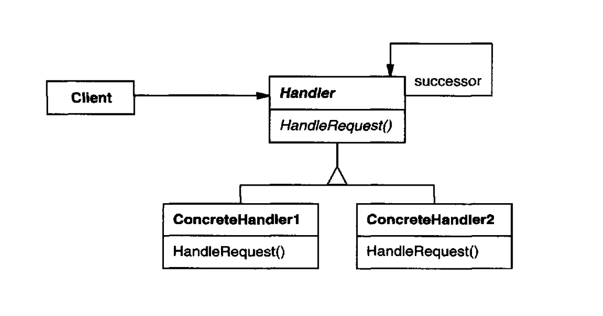

Avoid coupling the sender of a request to its receiver by giving more than one
object a chance to handle the request. Chain the receiving objects and pass the
request along the chain until an object handles it.

# Applicability

Use Chain of Responsibility when

More than one object may handle a request, and the handler isn't known a
priori. The handler should be ascertained automatically. [Which I link to] 
Use the Chain of Responsibility pattern when your program is expected to process 
different kinds of requests in various ways, but the exact types of requests and their sequences are unknown beforehand.

You want to issue a request to one of several objects without specifying the
receiver explicitly.

The set of objects that can handle a request should be specified dynamically. [Which I link to] 
When the set of handlers and their order are supposed to change at runtime.

Use the pattern when it’s essential to execute several handlers in a particular order.

## Pros

You can control the order of request handling.

**Single Responsibility Principle**. You can **decouple** classes that invoke operations 
from classes that perform operations.

Open/Closed Principle. You can introduce new handlers into the app without breaking 
the existing client code.

## Cons 

Some requests may end up unhandled.

## Comments worth mentioning

1. Reduced coupling. **The pattern frees an object from knowing which other
object handles a request**. An object only has to know that a request will be
handled "appropriately." Both the receiver and the sender have no explicit
knowledge of each other, and an object in the chain doesn't have to know
about the chain's structure.

2. Added **flexibility** in assigning responsibilities to objects. Chain of Responsibility
gives you added flexibility in distributing responsibilities among objects.
You can add or change responsibilities for handling a request by adding
to or otherwise changing the chain at run-time. **You can combine this with
subclassing to specialize handlers statically**.

## Comments about Implementation worth mentioning

1. Implementing the successor chain. There are two possible ways to implement
the successor chain:

    (a) Define new links (usually in the Handler, but ConcreteHandlers could
    define them instead).

    (b) Use existing links.

    Our examples so far define new links, but often you can use existing object
    references to form the successor chain. For example, parent references in a
    part-whole hierarchy can define a part's successor. **Composite discusses parent
    references in more detail**.

    [meaning you can use an extructure and its binding instead of defining new links]

    Using existing links works well when the links support the chain you need.
    It saves you from defining links explicitly, and it saves space. But if the
    structure doesn' t reflect the chain of responsibili ty your application requires,
    then you'll have to define redundant links.

2. Representing requests. Different options are available for representing requests.
In the simplest form, the request is a hard-coded operation invocation [direct], as in
the case of HandleHelp [see page 227]. This is convenient and safe, but you can forward
only the fixed set of requests that the Handler class defines.

        make further inquirements/review this implementation

# Diagram

