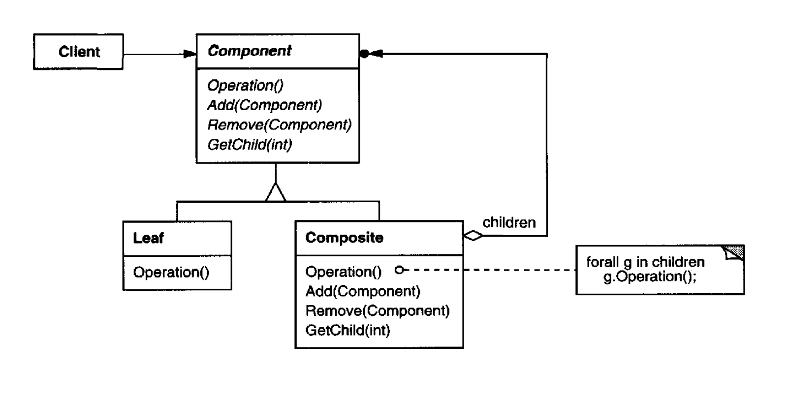

The Composite pattern provides you with two basic element types that share a common interface: simple leaves and complex containers. A container can be composed of both leaves and other containers. This lets you construct a nested recursive object structure that resembles a tree.

# Applicability

You want to represent part-whole hierarchies of objects or implement a tree-like object structure.

you want clients to be able to ignore the difference between compositions of
objects and individual objects. **Clients will treat all objects in the composite
structure uniformly. Treatment is uniformly.**

## Pros

**Open/Closed Principle**. You can introduce new element types into the app without breaking the existing code, which now works with the object tree.

You can work with complex tree structures more conveniently: use polymorphism and recursion to your advantage.

## Cons 

It might be difficult to provide a common interface for classes whose functionality differs too much. In certain scenarios, you’d need to overgeneralize the component interface, making it harder to comprehend.

# Diagram

