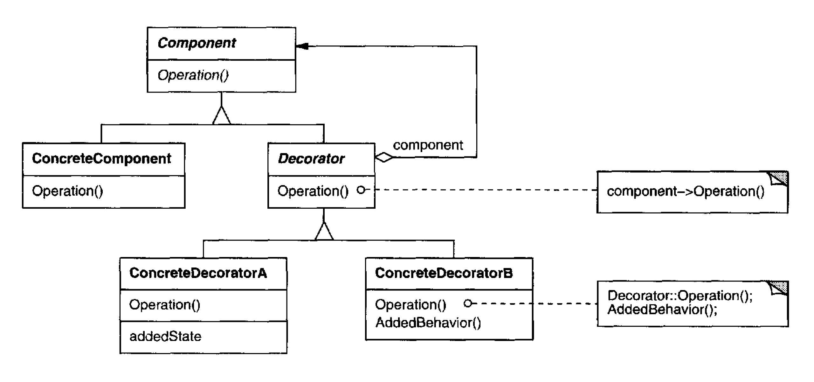

Attach additional responsibilities to an object dynamically. Decorators provide a
flexible alternative to subclassing for extending functionality.

# Applicability

To add responsibilities to individual objects dynamically and transparently,
that is, without affecting other objects. [Which I link to] Use the Decorator 
pattern when you need to be able to assign extra behaviors to objects at runtime 
without breaking the code that uses these objects.

For responsibilities that can be withdrawn.

When extension by subclassing is impractical. Sometimes a large number
of independent extensions are possible and would produce an explosion of
subclasses to support every combination. Or a class definition maybe hidden
or otherwise unavailable for subclassing.

## Pros

You can extend an object’s behavior without making a new subclass.

You can add or remove responsibilities from an object at runtime.

You can combine several behaviors by wrapping an object into multiple decorators.

**Single Responsibility Principle**. You can divide a monolithic class that implements 
many possible variants of behavior into several smaller classes

## Cons 

It’s hard to implement a decorator in such a way that its behavior doesn’t depend 
on the order in the decorators stack

The initial configuration code of layers might look pretty ugly

It’s hard to remove a specific wrapper from the wrappers stack.

## Comments worth mentioning

1. More flexibility than static inheritance. The Decorator pattern **provides a more
flexible way to add responsibilities to objects than can be had with static
(multiple) inheritance**. With decorators, responsibilities can be added and
removed at run-time simply by attaching and detaching them. In contrast,
inheritance requires creating a new class for each additional responsibility

2. Avoids feature-laden classes high up in the hierarchy. Decorator offers a pay as-
you-go approach to adding responsibilities. Instead of **trying to support
all foreseeable features in a complex**, customizable class, you can define
a simple class and add functionality incrementally with Decorator objects.

3. Lots of little objects. A design that uses Decorator often results in systems
composed of lots of little objects that all look alike. The objects differ only
in the way they are interconnected, not in their class or in the value of
their variables. Although these systems are easy to customize by those who
understand them, **they can be hard to learn and debug**.

## Comments about Implementation worth mentioning

1. Keeping Component classes lightweight. To ensure a conform inginterface, components
and decorators must descend from a common Component class.
It's important to keep this common class lightweight; that is, it should focus
on defining an interface, **not on storing data**. The definition of the data
representation should be deferred to subclasses; otherwise the complexity
of the Component class might make the decorators too heavyweight to use
in quantity.

2. Strategies are a better choice in situations where the Component class is
**intrinsically heavyweight**, thereby making the Decorator pattern too costly
to apply. In the Stra tegypattern, the component forwards some of i ts behavior
to a separate strategy object. The Strategy pattern lets us alter or extend the
component's functionality by replacing the strategy object.
 
# Diagram

