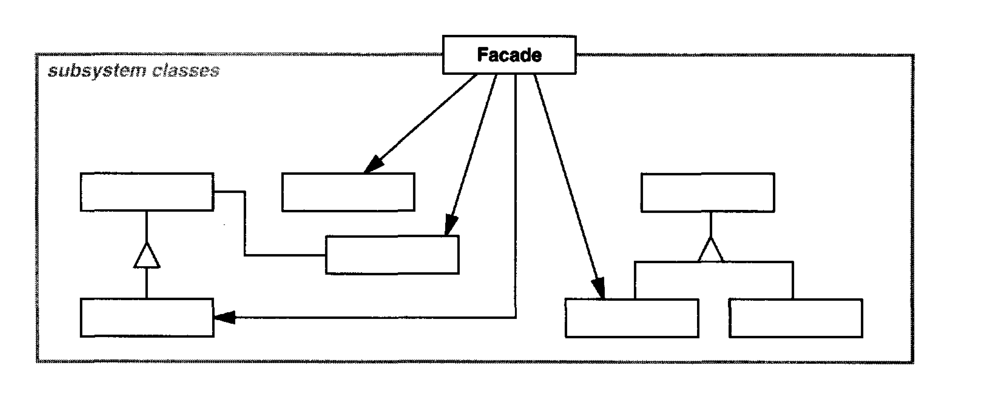

Provide a unified interface to a set of interfaces in a subsystem. Facade defines a
higher-level interface that makes the subsystem easier to use.

# Applicability

You want to provide a **simple interface to a complex subsystem**. Subsystems
often get more complex as they evolve. Most patterns, when applied, result
in more and smaller classes. This makes the subsystem more reusable and
easier to customize, but it also becomes harder to use for clients that don't
need to customize it. A facade can provide a simple default view of the
subsystem that is good enough for most clients. Only clients needing more
customizability will need to look beyond the facade.

There are many dependencies between clients and the implementation classes
of an abstraction. Introduce a facade **to decouple the subsystem from clients
and other subsystems**, thereby promoting subsystem independence and
portability.

**You want to layer your subsystems**. Use a facade to define an entry point to
each subsystem level. If subsystems are dependent, then you can simplify
the dependencies between them by making them communicate with each
other solely through their facades.

    Having a facade is handy when you need to integrate your app with a sophisticated library that has dozens of features, but you just need a tiny bit of its functionality.

## Pros

You can isolate your code from the complexity of a subsystem.

## Cons 

A facade can become a god object coupled to all classes of an app.

## Comments worth mentioning

It promotes **weak coupling between the subsystem** and its clients. Often the
components in a subsystem are strongly coupled. Weak coupling lets you
vary the components of the subsystem without affecting its clients. Facades 
help layer a system and the dependencies between objects. They can eliminate
complex or circular dependencies. This can be an important consequence
when the client and the subsystem are implemented independently.

## Comments about Implementation worth mentioning

Reducing client-subsystem coupling. **The coupling between clients and the subsystem
can be reduced even further by making Facade an abstract class
with concrete subclasses for different implementations of a subsystem**. Then
clients can communicate with the subsystem through the interface of the abstract 
facade class. This abstract coupling keeps clients from knowing which
implementation of a subsystem is used.
An alternative to subclassing is to configure a Facade object with different
subsystem objects. To customize the facade, simply replace one or more of
its subsystem objects.

# Diagram

