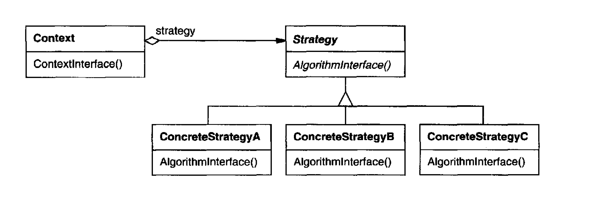

Define a family of algorithms, encapsulate each one, and make them interchangeable.
Strategy lets the algorithm vary independently from clients that use it.

# Applicability

Many related classes differ only in their behavior. Strategies provide a way
to configure a class with one of many behaviors.

You need different variants of an algorithm. For example, you might define
algorithms reflecting different space/time trade-offs. Strategies can be
used when these variants are implemented as a class hierarchy of algorithms. 
[I think you can link this to the refactoring guru stataments which is as follows]. 
The Strategy pattern lets you extract the varying behavior into a separate 
class hierarchy and combine the original 
classes into one, thereby reducing duplicate code.

An algorithm uses data that clients shouldn't know about. Use the Strategy
pattern to **avoid exposing complex, algorithm-specific data structures**.

A class defines many behaviors, and these appear as multiple conditional
statements in its operations. **Instead of many conditionals**, move related
conditional branches into their own Strategy class.

    Use the Strategy pattern when you want to use different variants of an 
    algorithm within an object and be able to switch from one algorithm to another during runtime.

## Pros

You can swap algorithms used inside an object at runtime.

**Open/Closed Principle**. You can introduce new strategies without having to change the context.

You can replace inheritance with composition.

You can isolate the implementation details of an algorithm from the code that uses it

## Cons 

If you only have a couple of algorithms and they rarely change, there’s no real reason to overcomplicate the program with new classes and interfaces that come along with the pattern.

Clients must be aware of the differences between strategies to be able to select a proper one.

A lot of modern programming languages have **functional type support** that lets you implement different versions of an algorithm inside a set of anonymous functions. Then you could use these functions exactly as you’d have used the strategy objects, but without bloating your code with extra classes and interfaces.

## Comments worth mentioning

**An alternative to subclassing**. Inheritance offers another way to support a
variety of algorithms or behaviors. You can subclass a Context class directly
to give it different behaviors. But this hard-wires the behavior into Context. It
mixes the algorithm implementation with Context's, making Context harder
to **understand, maintain, and extend**. And you can't vary the algorithm
dynamically. You wind up with many related classes whose only difference
is the algorithm or behavior they employ. Encapsulating the algorithm in
separate Strategy classes lets you vary the algorithm independently of its
context, making it easier to switch, understand, and extend.

# Diagram

